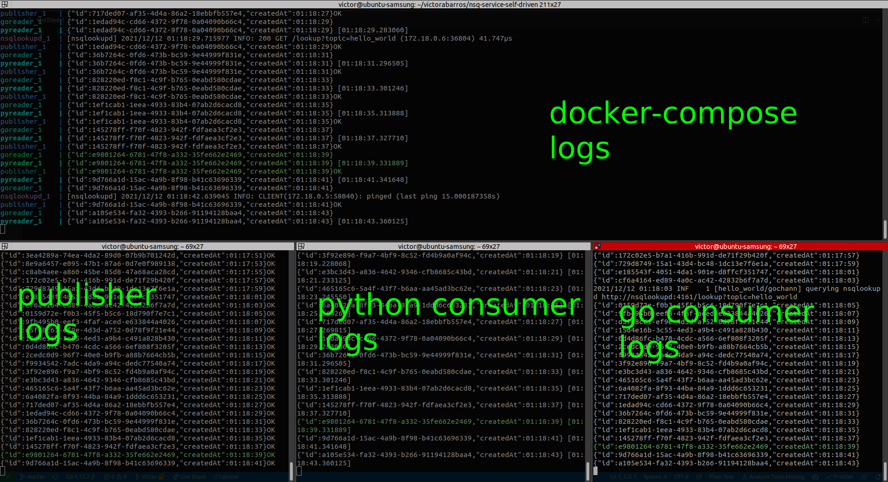

# NSQ SELF DRIVEN 📨

[](https://codeclimate.com/github/victorabarros/nsq-service-self-driven/maintainability)

[NSQ](https://nsq.io/) Self.Driven is an entire ecosystem in containers with publisher, message platform and consumer.

Article [NSQ with Docker in baby steps, less then 70 lines of code](https://victoralmeidabarros.medium.com/nsq-with-docker-in-baby-steps-70-lines-of-code-381ac37eaf58)

## Usage
<!-- 
## Usage

`Makefile`

```sh
make clean-up
# remove containers and images

make start
# start docker-compose project

make log
# follow container logs
```
-->

<p align="center">
    
  </a>
</p>

Container logs:

<p align="center">
    
    <!-- Font: https://nsq.io/overview/design.html#simplifying-configuration-and-administration -->
  </a>
</p>

---

<p align="center">
  <br/>
  Made in Brazil
  <br/>
  
</p>
