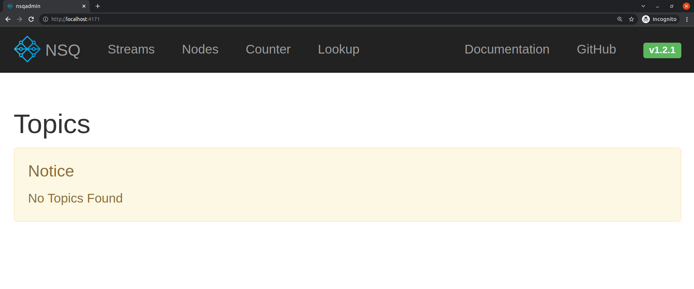
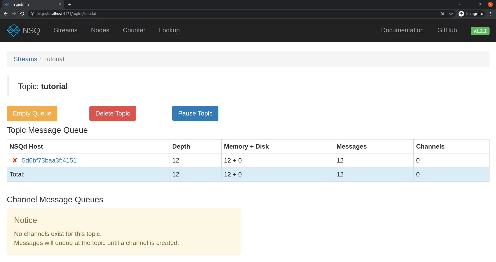
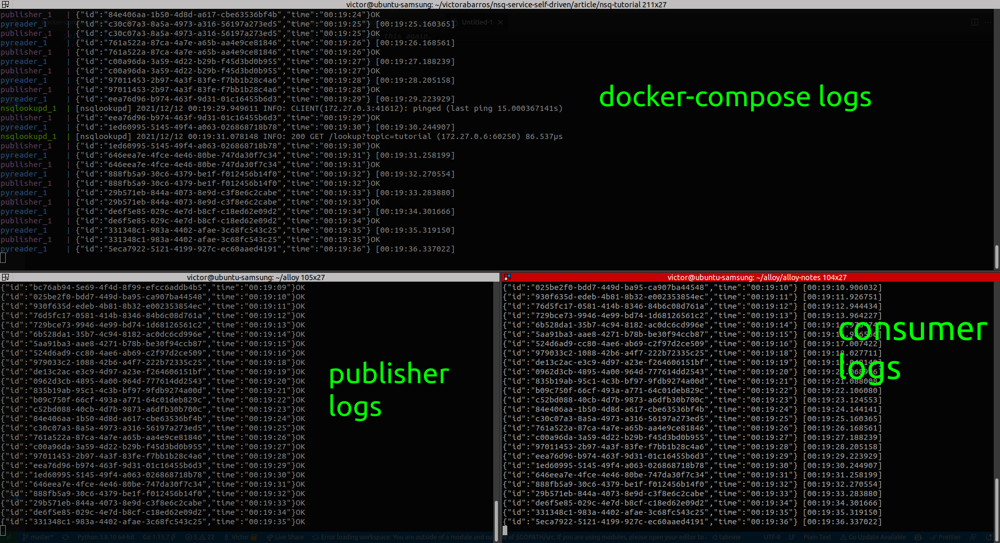
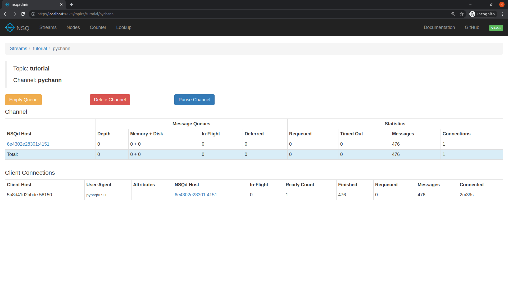
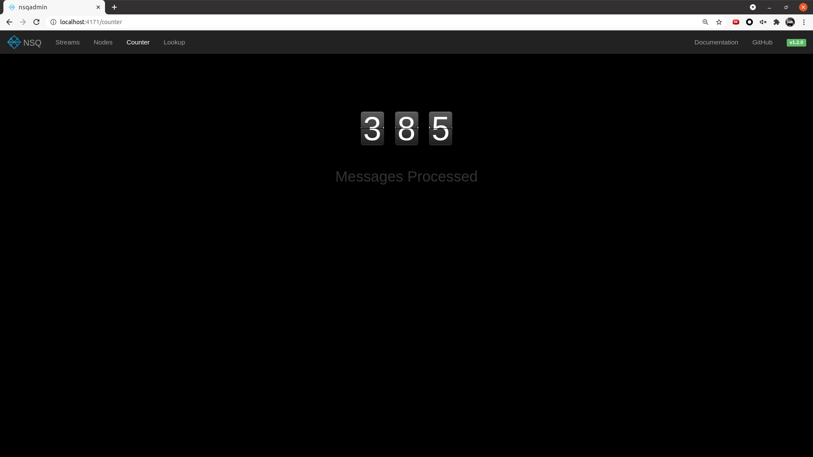

# NSQ with Docker in baby steps, in 70 lines of code

## Intro

In the last years, one of the most popular buzzword in the technology scenarios was **event**:
Event sourcing pattern, event-driven programming, domain event pattern, event-driven architecture…
And already exists tons of good content about these on internet and many tools to apply them.
Here I'll perform a tutorial to run the full stack of an event system, in less than 70 lines of code, with publisher and consumer using **shell**, **Python** and **Docker/Docker-Compose**.

Ladies and Gentlemen, I introduce yourselves to **NSQ**, probably the simplest tool that can make your own system event-friendly.

## NSQ

I'll not go deep on NSQ anatomy, the official website has excellent documentation about that.
But to begin, it's important to know the basics about how the NSQ drives inside the system.
When a publisher sends an event to the topic **clicks**, the message is cloned to all the channels of the topic and then the message is delivered randomly to one consumer.

<p align="center">
    
    <!-- Font: https://nsq.io/overview/design.html#simplifying-configuration-and-administration -->
  </a>
</p>

### NSQ setup

The NSQ is composed of 3 services:

- **nsqd**
  - the daemon that receives, queues, and delivers messages to clients
- **nsqlookupd**
  - manages topology information and provides an eventually consistent discovery service
- **nsqadmin**
  - web UI to introspect the cluster

It's possible to start them all from the same official docker images `nsqio/nsq`.

## Hands on

### Requiremets

- Docker
- Docker-Compose

### Step One - docker-compose

First, create a directory to the project

```sh
mkdir nsq-tutorial
```

Inside that, write the `docker-compose.yml`:

```yml
version: "3"
services:
  nsqlookupd:
    image: nsqio/nsq:v1.2.1
    command: /nsqlookupd
    ports:
      - "4160:4160"
      - "4161:4161"
  nsqd:
    image: nsqio/nsq:v1.2.1
    command: /nsqd --lookupd-tcp-address=nsqlookupd:4160
    depends_on:
      - nsqlookupd
    ports:
      - "4150:4150"
      - "4151:4151"
  nsqadmin:
    image: nsqio/nsq:v1.2.1
    command: /nsqadmin --lookupd-http-address=nsqlookupd:4161
    depends_on:
      - nsqlookupd
    ports:
      - "4171:4171"
```

Now is possible to run `docker-compose up` and _voilá_ watch the nsqadmin on `http://localhost:4171/`.

<p align="center">
    
  </a>
</p>

### Step Two - Publisher

To send your first message, the nsqd server exposes an endpoint to receive events.
The following command illustrates how to send an empty payload to the `hello_world` topic.
This topic doesn't exist yet, but the nsqd server will automatically create it.

`curl -d "{}" http://localhost:4151/pub?topic=hello_world`

Now we know how to publish messages, let's code a script to automatize that.

```sh
mkdir publisher
```

On publisher directory, write `publisher/run.sh`:

```sh
while true
do
    ID=$(uuidgen -r)
    NOW=$(date +%T)
    PAYLOAD="{\"id\":${ID},\"time\":${NOW}}"
    printf "\n${PAYLOAD}"
    curl -s -d ${PAYLOAD} "nsqd:4151/pub?topic=tutorial"
    sleep 1
done
```

And to host the service, write its `publisher/Dockerfile`:

```Dockerfile
FROM alpine:3.15.0

COPY ./run.sh ./run.sh
RUN apk add --no-cache curl util-linux

ENTRYPOINT ["sh", "./run.sh"]
```

Add the new service to `docker-compose.yml` file

```yml
  publisher:
    build: ./publisher/.
    depends_on:
      - nsqlookupd
```

Now exec `docker-compose up` to start the project and see at `http://localhost:4171/topics/tutorial` the publisher filling the _Depth_ field.

<p align="center">
    
  </a>
</p>

### Step Three - Python Consumer

NSQ has a lot of libraries to help with implementation.
Let' starts with python3 one:

First, create the directory on the root of the project.

```sh
mkdir pyreader
```

The library makes our life much easier, these few lines are enough to read the messages.
Write the `pyreader/app.py`.

```py
from datetime import datetime
import nsq
import sys

def handler(msg):
    print(msg.body.decode(), f"[{datetime.utcnow().strftime('%H:%M:%S.%f')}]", flush=True)
    return True

if __name__ == "__main__":
    sys.stdout.flush()
    r = nsq.Reader(message_handler=handler,
                   lookupd_http_addresses=['nsqlookupd:4161'],
                   topic="tutorial",
                   channel="pychann",
                   lookupd_poll_interval=15)
    nsq.run()
```

The `pyreader/Dockerfile`

```Dockerfile
FROM python:3.10-slim

COPY . .
RUN pip3 install --no-cache pynsq==0.9.1

ENTRYPOINT ["python3"]
CMD ["app.py"]
```

Add the new service to `docker-compose.yml` file

```yml
  pyreader:
    build: ./pyreader/.
    depends_on:
      - publisher
```

Run `docker-compose build` and `docker-compose up` on root and now you can see the message published printing on console:

<p align="center">
    
  </a>
</p>

Or follow the counter here `http://localhost:4171/topics/tutorial/pychann` and realtime in all channels here `http://localhost:4171/counter`.

<p align="center">
    
  </a>
    
</p>

## Project Tree

```md
/nsq-tutorial/
|-- docker-compose.yml
|-- publisher/
|   |-- Dockerfile
|   |-- run.sh
|-- pyreader/
|   |-- Dockerfile
|   |-- app.py
```

## Conclusion

See how easy and quickly is develop an event system?

NSQ is an elegant solution with super easy introduction.
I highly recommend reading more in its documentation and studying more implementations.

At github.com/victorabarros/nsq-service-self-driven you can see this project and more features, like Makefile and consumer written in Golang.
Also, message tracking in different consumers.

I hope you enjoy! =D

<p align="center">
    
  </a>
</p>

## References

- NSQ introduction in gophercon 2014 [link](https://youtu.be/CL_SUzXIUuI)
- NSQ documentation [link](https://nsq.io/)
- NSQ official docker image [link](https://hub.docker.com/r/nsqio/nsq)
- Install docker [link](https://docs.docker.com/engine/install/)
- Manage docker as non root user [link](https://docs.docker.com/engine/install/linux-postinstall/#manage-docker-as-a-non-root-user)
- Install docker-compose [link](https://docs.docker.com/compose/install/)
- Github victorabarros/nsq-service-self-driven project [link](https://github.com/victorabarros/nsq-service-self-driven)
