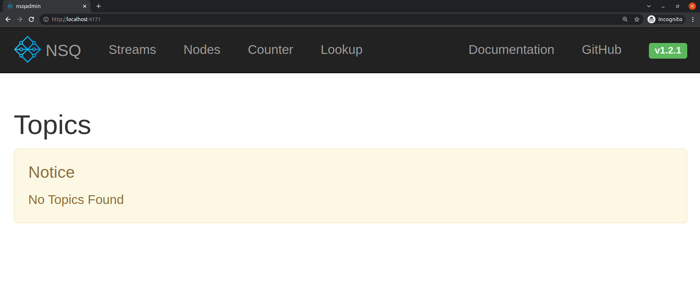
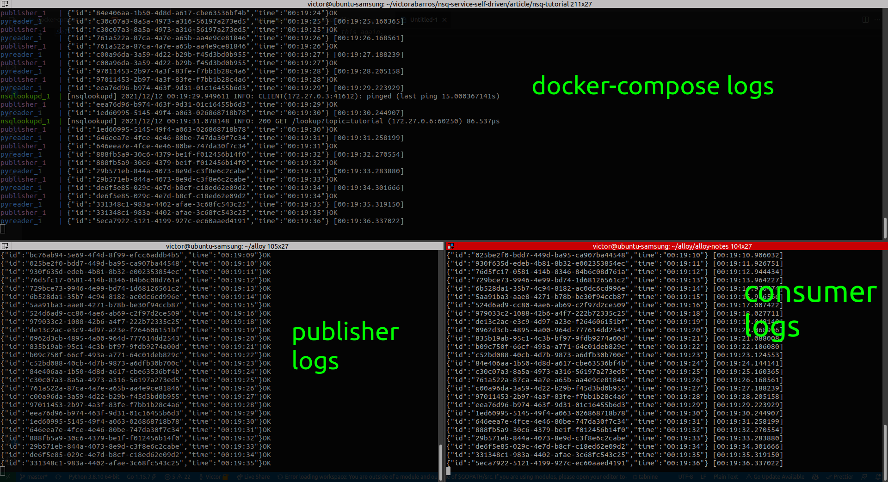

# NSQ with Docker in baby steps, less then 70 lines of code

## Intro

In the last years, one of the most popular buzzword in the technology scenarios was **event**: Event sourcing pattern, event-driven programming, domain event pattern, event-driven architecture …
And already exists tons of good content about this on the internet and many tools to apply these concepts.
Here I'll perform a tutorial to run the full stack of an event system, in less than 70 lines of code, with publisher and consumer using **shell**, **Go**, **Python** and **Docker**.
<!--
Buscando conhecimento sobre o assunto vi que a teoria básica é tão simples quanto imaginar um serviço q recebe payloads ordenados em filas que serão consumidas por outros serviços, podendo ou não ser dstribuidas de forma randomica entre os consumidores ou duplicadas.
Mas quando olhamos as opções de prateleiras podemos ficar perdidos na variedade e complexidade.
Nesta aventura, uma opção que me chocou diante de sua SIMPLICIDADE foi o NSQ.
-->
Ladies and Gentlemen, I introduce yourselves to **NSQ**, probably the simplest tool that can make your system event-friendly.
<!-- _NSQ is a realtime distributed messaging platform_ ready to run in super easies steps. -->
<!-- I'll not speend time explaining about NSQ and your features, the official documentation makes a great job. -->
<!-- But, to make this case even more professional, let's use Docker
-->

## NSQ

I'll not go deep on NSQ anatomy, the official website has excelent documentation about that.
But to begin, it's important to know the basics about how the NSQ drives inside the system.
When a publisher sends an event to the topic **clicks**, the message is cloned to all the channels of the topic and then the message is delivered randomly to one consumer.
<!-- So before start read this chapter from official documentation to be ensurence about the next steps. -->

<p align="center">
    
    <!-- Font: https://nsq.io/overview/design.html#simplifying-configuration-and-administration -->
  </a>
</p>

## NSQ setup

The NSQ is compose of 3 services:

- **nsqd**
  - manage the messages
- **nsqlookupd**
  - manages topology information and provides an eventually consistent discovery service
- **nsqadmin**
  - web UI to introspect the cluster

Is possible start all them from the same official docker images `nsqio/nsq`.
With that, write the `docker-compose.yml` is very easy:

```yml
version: "3"
services:
  nsqlookupd:
    image: nsqio/nsq
    command: /nsqlookupd
    ports:
      - "4160:4160"
      - "4161:4161"
  nsqd:
    image: nsqio/nsq
    command: /nsqd --lookupd-tcp-address=nsqlookupd:4160
    depends_on:
      - nsqlookupd
    ports:
      - "4150:4150"
      - "4151:4151"
  nsqadmin:
    image: nsqio/nsq
    command: /nsqadmin --lookupd-http-address=nsqlookupd:4161
    depends_on:
      - nsqlookupd
    ports:
      - "4171:4171"
```

And now already is possible run `docker-compose up` and watch the nsqadmin on `http://localhost:4171/`.

<p align="center">
    
  </a>
</p>

To send your first message, the nsqd server exposes an endpoint to receive events. The following example is sending an empty payload to the `hello_world` topic, that doesn't exist yet, but the nsqd server will automatically create.

`curl -d "{}" http://localhost:4151/pub?topic=hello_world`

The [nsqd and nsqlookupd](#References) exposes a list of endpoints that allow you to manage the topics, channels and monitoring the service.

## Publisher

With a such easy when to publish message using `curl` command, let's code an script to automatize the publisher.
<!-- As we already saw, with a simple `curl` command is possible to publish messages.
So let's code a script that iterates and execute curl command: -->

```sh
while true
do
    curl -d "{\"foo\":\"bar\"}" "nsqd:4151/pub?topic=hello_world"
    sleep 2
done
```

`Dockerfile`:

```Dockerfile
FROM alpine

COPY ./publish.sh ./publish.sh
RUN apk add --no-cache curl

ENTRYPOINT ["sh", "./publish.sh"]
```

Add the new service to .yml file

```yml
  publisher:
    build: ./publisher/.
    depends_on:
      - nsqlookupd
```

Now exec `docker-compose up` to start the project and see at `http://localhost:4171/topics/hello_world` the publisher filling the _Depth_ field.

[screenshot]

## Consumer

NSQ has a lot of libaries to help on implementation.
For this tutorial let's use the python one:

```py
import nsq
import sys

def handler(msg):
    print(msg.body.decode(), flush=True)
    return True

if __name__ == "__main__":
    sys.stdout.flush()
    r = nsq.Reader(message_handler=handler,
                   lookupd_http_addresses=['nsqlookupd:4161'],
                   topic="hello_world",
                   channel="pychann",
                   lookupd_poll_interval=15)
    nsq.run()
```

`Dockerfile`:

```Dockerfile
FROM python

COPY . .
RUN pip3 install --no-cache pynsq

ENTRYPOINT ["python3"]
CMD ["reader.py"]
```

Add to .yml:

```yml
  consumer:
    build: ./pyreader/.
    depends_on:
      - publisher
```

Now you can see the message published printing on console:

<p align="center">
    
  </a>
</p>

Or follow the counter here `http://localhost:4171/topics/hello_world/pychann` and realtime in all channels here `http://localhost:4171/counter`.

<!-- improve screenshot. aumentar fonte -->
<p align="center">
    
  </a>
</p>

## Project Tree

```md
/nsq-project/
|-- docker-compose.yml
|-- pyreader/
|   |-- Dockerfile
|   |-- reader.py
|-- publisher/
|   |-- Dockerfile
|   |-- publish.sh
```

## Conclusion

<!--
Como podemos ver, subir um projeto de ponta a ponta com NSQ leva menos de 70 linhas de código
-->

## More Informations

At github.com/victorabarros/nsq-service-self-driven you can se this same project with more funcionalities and with a consumer in go.

I hope you enjoy! =D

## References

- NSQ introduction in gophercon 2014 <https://youtu.be/CL_SUzXIUuI>
- NSQ documentation <https://nsq.io/>
  - nsqd server routes <https://nsq.io/components/nsqd.html#http-api>
  - nsqlookupd server routes <https://nsq.io/components/nsqlookupd.html#http-interface>
  - using docker-compose on nsq <https://nsq.io/deployment/docker.html#using-docker-compose>
  - nsq client libraries <https://nsq.io/clients/client_libraries.html#client-libraries>
- docker documentation <https://www.docker.com/>
- how to install docker <https://docs.docker.com/engine/install/>
  - manage docker as non root user <https://docs.docker.com/engine/install/linux-postinstall/#manage-docker-as-a-non-root-user>).
  - how to install docker-compose <https://docs.docker.com/compose/install/>
- nsq official docker image <https://hub.docker.com/r/nsqio/nsq>
- nsq repository <https://github.com/nsqio/nsq>
- github project <https://github.com/victorabarros/nsq-service-self-driven>
